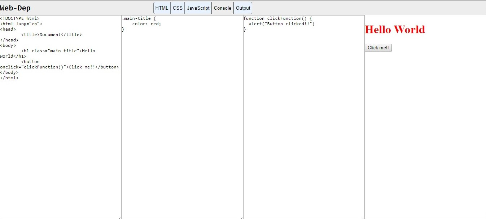

# WEB-DEP
A webpage built from scratch to run HTML, CSS, JS code simultaneously and show the respective output on the same page.Inspired from JS Bin website.
The webpage is written using HTML, CSS, Jquery.Except the design all the code is written without any outside refrence.
Iframe is used to run the HTML, CSS content written by the user.
Eval function from JavaScript is used to apply user's JS code to the output_window.

Jquery file linked to the webpage is provided along with the html document of the webpage.

-Console window is disabled as it's application on the Iframe is out of scope currently.
Any ideas on it's implementation are welcome:)

# Screenshot

